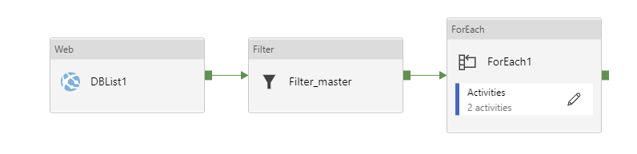

# Pause and Resume Synapse SQL pools using Data Factory

## Introduction

The process below describes one way to automate the pausing and restarting of Synapse SQL pools (previously known as SQL DW instances), using Azure Data Factory. While there are many ways of doing this, most examples seem to be overly complicated for what should be a simple process. Also, it makes sense to include this as part of any existing data orchestration process, which typically means it need to be implemented in Data Factory. Thus, this blog will show how easy it is to implement this in Data Factory and take you through the steps required.
The process I will describe below goes through a set of steps:
<ol start="1">
<li>Identify the list of databases (SQL pools) in your SQL server instance</li>
<li>Remove any irrelevant databases from this list (e.g. master)</li>
<li>Loop over each database and:
<pre><code>i. Check the state of the database
ii.  Depending upon its status, Initiate the Pause or Restart
</code></pre>
</li>
</ol>

This requires a simple pipeline in Data Factory:

Depending upon the nature of your environment, the whole process described here may not apply and you may just want to pick and choose the appropriate step. Typically the process described here would be used to Pause or Restart all instances in a Development, Test or PoC environment – where the number of instances could vary over time – whereas for a live environment you are more likely to schedule Pause/Restart on a instance by instance basis so will only need step 3.
All of the steps above utilise the REST APIs for Synapse and Azure SQL:
https://docs.microsoft.com/en-us/azure/synapse-analytics/sql-data-warehouse/sql-data-warehouse-manage-compute-rest-api
https://docs.microsoft.com/en-us/rest/api/sql/
so you are not restricted to using Data Factory; you can execute these commands via the tools or application of your choice.

## Step 0: Parameter setup in your pipeline
The examples below are parameter driven, which will allow you to create a generic pipeline that you can use across multiple subscriptions, resource groups, SQL servers and/or Database instances (SQL pools). These are setup in your Azure pipeline under parameters
 

## Step 1: Identify the list of databases (SQL pools) in your SQL server instance
This requires a Web Activity that calls the Databases - List By Server REST API request:
 
This is a simple Get request using the following call:
GET https://management.azure.com/subscriptions/{subscription-id}/resourceGroups/{resource-group-name}/providers/Microsoft.Sql/servers/{server-name}/databases?api-version=2017-10-01-preview
Which in the example above I have parameterised using the @concat string function:
@concat('https://management.azure.com/subscriptions/',pipeline().parameters.Subscription,'/resourceGroups/',pipeline().parameters.ResourceGroup,'/providers/Microsoft.Sql/servers/',pipeline().parameters.ServerName,'/databases?api-version=2017-10-01-preview')
The output is a JSON string that contains a list of the database instances in the SQL server named above. This is passed to the next activity.

## Step 2: Filter the list to remove any irrelevant databases
This requires a Filer Activity that filters based on the values passed from the DBList1 Activity.
 
In this example, we are simply extracting the records from the array that are not named “master”. Other conditions could be applied as required, such as filtering on the sku/name of “DataWarehouse” to ensure only valid Synapse SQL pools are identified.
Here the command under Item is: @activity('DBList1').output.value where DBList1 is the name of the preceding Web activity
The command under Condition is: @not(startswith(item().name,'master'))
The remaining records in the array are then passed to the next activity.

## Step 3: Loop over each record/database
Create a ForEach activity to loop over each database where the full pipeline with the above activities are being run. 
 
Alternatively, if you are simply running this for a single database, complete Step 0 and follow the next steps.
 
### Step 3a: Check the state of the database
This requires a Web Activity, similar to Step1. This activity calls the Check database state REST API for Azure Synapse https://docs.microsoft.com/en-us/azure/synapse-analytics/sql-data-warehouse/sql-data-warehouse-manage-compute-rest-api#check-database-state:
 
This again uses a simple Get request using the following call:
GET https://management.azure.com/subscriptions/{subscription-id}/resourceGroups/{resource-group-name}/providers/Microsoft.Sql/servers/{server-name}/databases/{database-name}?api-version=2014-04-01 HTTP/1.1
Which in the example above I have parameterised using the @concat string function:
@concat('https://management.azure.com/subscriptions/',pipeline().parameters.Subscription,'/resourceGroups/',pipeline().parameters.ResourceGroup,'/providers/Microsoft.Sql/servers/',pipeline().parameters.ServerName,'/databases/',item().name,'?api-version=2014-04-01')
In this case we are using item().name – then name of the database from Step 1 – that that was passed to this activity from the ForEach loop. If you are using in a pipeline to control a single database, you can embed the name of your Synapse SQL pool here, or use a parameter from the pipeline (e.g. pipeline().parameters.DatabaseName using the example in Step 0)
The output is a JSON string that contains details of the SQL pool, including its status (in properties.status). This is passed to the next activity.

### Step 3b: Evaluate the status and then initiate the Pause or Restart
Create an If Condition activity and use this to evaluate the status from the previous step.  
 
An If Condition activity requires a Boolean output, so in this example we are using the startswith function that returns true or false:
@startswith(activity('CheckState').output.properties.status,'Paused') 
where CheckState is the name of the preceding Web activity
This is simply doing a check of the status – if it is paused it invokes the true activity (Restart) within the If Condition, if not it invokes the false activity (Pause).
Within the appropriate activity branch add the final step.

### Step 3c: – Synapse Pause or Restart
The final step (and this may be the only relevant step for some requirements), is to initiate the Pause or Restart of your Synapse SQL pool. This, like steps 1 and 3a, is a simple Web activity, calling the Pause or Resume compute REST API for Azure Synapse https://docs.microsoft.com/en-us/azure/synapse-analytics/sql-data-warehouse/sql-data-warehouse-manage-compute-rest-api#pause-compute:
 
The example here is to resume a SQL pool, invoking a POST request using the following call:
POST https://management.azure.com/subscriptions/{subscription-id}/resourceGroups/{resource-group-name}/providers/Microsoft.Sql/servers/{server-name}/databases/{database-name}/resume?api-version=2014-04-01-preview HTTP/1.1
Which in the example above I have parameterised using the @concat string function:
@concat('https://management.azure.com/subscriptions/',pipeline().parameters.Subscription,'/resourceGroups/',pipeline().parameters.ResourceGroup,'/providers/Microsoft.Sql/servers/',pipeline().parameters.ServerName,'/databases/',activity('CheckState').output.name,'/resume?api-version=2017-10-01-preview')
In this case we are using activity('CheckState').output.name – the name of the SQL pool from Step 3a – that that was passed to this activity through the IF Condition loop. If you are using this a single activity against a single database, you could embed the name of your Synapse SQL pool here, or use a parameter from the pipeline (e.g. pipeline().parameters.DatabaseName using the example in Step 0).

### Data Factory Output
When the full pipeline described above is run, this is the output you will receive. Note that when I ran the pipeline for the results below, one of the SQL pools was already running (so initiated a Pause event), while the other was Paused so initiated a Restart.
 
#### Important Authentication notes:
For all of the Web Activities / REST API Web calls, you need to ensure that Data Factory is Authenticated against the SQL server. Managed Identity is required to run these REST API calls: https://docs.microsoft.com/en-us/azure/data-factory/control-flow-web-activity#managed-identity
 
Further details on Managed Identity for Data Factory, and how the Data Factory’s Managed Identity is added to your SQL Server can be found here:
https://docs.microsoft.com/en-us/azure/data-factory/data-factory-service-identity
https://docs.microsoft.com/en-us/azure/role-based-access-control/role-assignments-portal
https://docs.microsoft.com/en-us/azure/role-based-access-control/built-in-roles
